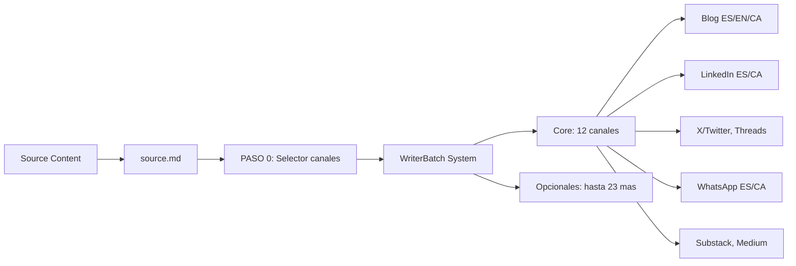

# MOC Content Factory - Owned Media

> Mapa de contenido para todos los proyectos de contenido para medios propios (LinkedIn, Blog, WhatsApp) generados con el sistema WriterBatch.

---

## Workspace & SEO Web

> Añadidos Mayo 2026 desde auditoría `claudecode-proj`.

| Documento | Tipo |
|-----------|------|
| [[Content_Factory_Workspace]] | Índice del workspace WriterBatch (clawdbook, content-library, etc.) |
| [[SEOzoopa_Web_SEO]] | SEO de zoopa.es — sub de ZOOPA_WEB_CONTENT |

---

## Sistema WriterBatch

El Content Factory utiliza el sistema **WriterBatch Zoopa** para generar contenido multi-formato desde una fuente única.

### Documentación del Sistema
- [[_system/workflow|workflow]] - Workflow completo
- [[_system/system_prompt_writerbatch_zoopa|system_prompt]] - System prompt
- [[_system/launch|launch]] - Comando de lanzamiento (legacy, pre-skill)
- [[_system/validador|validador]] - Validación de contenido
- [[_system/readme|readme]] - README del sistema

### Skill Launch (Claude Code)
- [[MOC Launch Skill]] - MOC del skill launch con flujo, canales y arquitectura
- [[doc-skill-launch-writerbatch-20260321]] - Documento de referencia completo v1.0
- Skill instalado en `~/.claude/skills/launch/` — activar con `/launch`

### Outputs por Proyecto
Cada proyecto puede generar hasta **35 canales** en 4 idiomas (ES, EN, CA, ES Facil).

**Core (12 canales por defecto):** Blog (ES/EN/CA), LinkedIn (ES/CA), X/Twitter, Threads, WhatsApp grupos (ES/CA), WhatsApp canal (ES/CA), Substack, Medium

**Opcionales (23 canales):** Dev.to, Hashnode, Hacker News, HackerNoon, DZone, Lobste.rs, Reddit (x2), Mirror.xyz, Farcaster, Mastodon, Bluesky, Trustpilot, Product Hunt, G2, Capterra, Quora, Discord, Telegram, YouTube Community, YouTube Shorts, Reels/TikTok, Blog Lectura Facil

Al ejecutar `launch.md`, el sistema pregunta primero que canales incluir.

---

## Proyectos por Fecha

### Noviembre 2024

| Fecha | Proyecto | Tema | Estado |
|-------|----------|------|--------|
| 2024-11-22 | [[2024-11-22_AI_News_Hackers_MCP/index\|AI News: Hackers MCP]] | Semana IA: Gemini 3, GPT-5, SAM 3 | Completo |
| 2024-11-23 | [[2024-11-23_LRMs_Large_Reasoning_Models/index\|LRMs]] | Ciberespionaje IA, GPT-5.1, Cursor | Completo |
| 2024-11-27 | [[2024-11-27_AI_Learning_Competencies/index\|AI Learning]] | AI Fluency, Competencias IA | Completo |

### Diciembre 2024

| Fecha | Proyecto | Tema | Estado |
|-------|----------|------|--------|
| 2024-12-07 | [[2024-12-07_GEO_Citations_Sources_imagin/index\|GEO Citations]] | Citaciones vs Fuentes LLM | Completo |
| 2024-12-28 | [[2024-12-28_Recommendation_Systems_eCommerce/index\|Recommendation Systems]] | Sistemas Recomendación eCommerce | Completo |
| 2024-12-28 | [[2024-12-28bis_eCommerce_Business_Models/index\|eCommerce Models]] | Top 10 Business Models 2026 | Completo |
| 2024-12-29 | [[2024-12-29_Agentic_Commerce_Future/index\|Agentic Commerce]] | Comercio Agéntico, AI Agents | Completo |
| 2024-12-29 | [[2024-12-29bis_Negotiation_Neurology/index\|Negotiation]] | Negociación y Neurología | Completo |
| 2024-12-30 | [[2024-12-30_GenZ_Workplace/index\|Gen Z Work]] | Gen Z en el Trabajo | Completo |

### Enero 2026

| Fecha | Proyecto | Tema | Estado |
|-------|----------|------|--------|
| 2025-01-24 | [[2025-01-24_clawdboat/index\|Clawdbot Campaign]] | AI Assistant Open Source, Multi-platform | Completo |

### Febrero 2026

| Fecha | Proyecto | Tema | Estado |
|-------|----------|------|--------|
| 2026-02 | [[2026-02_Radar2026_Colegi/index\|Radar 2026 Colegi]] | GEO Radar Colegi | En progreso |

### Marzo 2026

| Fecha | Proyecto | Tema | Estado |
|-------|----------|------|--------|
| 2026-03-13 | [[article-limit-sentiment-intencions-20260313\|El limit del sentiment]] | Articulo Argemi: intencion vs sentimiento | Completo |
| 2026-03-13 | [[doc-skill-intent-analysis-20260313\|Intent Analysis Skill - Doc Referencia]] | Documento completo del skill con taxonomia, fuentes y extensiones | Completo |
| 2026-03-13 | [[intent-analysis-skill-mczoopa-20260313.html\|Intent Analysis Skill - Informe mczoopa]] | Informe formato McKinsey con todo el contenido | Completo |

---

## Por Temática

### Inteligencia Artificial
- [[2024-11-22_AI_News_Hackers_MCP/index|AI News: Hackers MCP]] - Noticias IA, Gemini 3, GPT-5
- [[2024-11-23_LRMs_Large_Reasoning_Models/index|LRMs]] - LRMs vs LLMs, ciberespionaje IA
- [[2024-11-27_AI_Learning_Competencies/index|AI Learning]] - Competencias IA, AI Fluency
- [[2025-01-24_clawdboat/index|Clawdbot Campaign]] - Asistente IA open-source, multi-plataforma

### GEO & SEO
- [[2024-12-07_GEO_Citations_Sources_imagin/index|GEO Citations]] - Citaciones vs Fuentes en LLMs

### eCommerce
- [[2024-12-28_Recommendation_Systems_eCommerce/index|Recommendation Systems]] - Sistemas recomendación ML
- [[2024-12-28bis_eCommerce_Business_Models/index|eCommerce Models]] - Top 10 modelos negocio 2026
- [[2024-12-29_Agentic_Commerce_Future/index|Agentic Commerce]] - Comercio agéntico, AI agents

### Business & Management
- [[2024-12-29bis_Negotiation_Neurology/index|Negotiation Neurology]] - Negociación y neurología
- [[2024-12-30_GenZ_Workplace/index|Gen Z Work]] - Gen Z en el trabajo

---

## Campañas Multi-Plataforma

> Proyectos que van más allá del flujo WriterBatch estándar, con distribución en 10+ plataformas incluyendo Reddit, Dev.to, Hashnode, Product Hunt, etc.

### Campañas Completadas

| Campaña | Plataformas | Fecha | Notas |
|---------|-------------|-------|-------|
| [[2025-01-24_clawdboat/index\|Clawdbot]] | 15 publicadas | 2026-01-25 a 2026-01-30 | Primera campaña multi-plataforma. Blog ES/EN/CA, Lenguaje Facil, LinkedIn, X/Twitter, WhatsApp (canales+grupos), Medium, Substack, Reddit, Trustpilot, Dev.to, Hashnode |

### Plataformas por Tipo de Producto

| Tipo Producto | Plataformas Recomendadas |
|---------------|--------------------------|
| **Open Source** | Reddit, Dev.to, Hashnode, HN, Lobsters |
| **SaaS/Commercial** | G2, Capterra, Product Hunt, Trustpilot |
| **Consumer App** | Product Hunt, App Store, Trustpilot |
| **Enterprise** | G2, Capterra, Gartner Peer Insights |

### Lecciones Aprendidas

- **G2/Capterra**: Solo para software comercial listado en su base de datos
- **Product Hunt**: Requiere launch oficial del creador
- **Wikipedia**: Requiere cobertura en medios tradicionales (no Twitter/GitHub)
- **Hashnode**: Primera vez requiere crear blog antes de publicar
- **Dev.to**: Editor Markdown puede dar error JSON al publicar; reintentar o publicar manualmente
- **Reddit r/selfhosted**: Regla 8 exige flair "AI-Assisted App (Fridays!)" para posts de IA
- **Threads**: Login problematico desde Playwright/Chrome automatizado
- **Substack**: Flujo "Continue" > "Send to everyone now" > puede pedir botones subscribe (skip)

---

## Flujo de Trabajo



---

## Métricas

### Contenido Generado
| Tipo | Cantidad |
|------|----------|
| Proyectos totales | 10 |
| Proyectos completos | 10 |
| Posts LinkedIn (ES) | 10 |
| Posts LinkedIn (CA) | 9 |
| Posts WhatsApp (ES) | 10 |
| Posts WhatsApp (CA) | 9 |
| Artículos Blog | 10 |
| Campañas Multi-plataforma | 1 |

---

## Proyectos Importados (claudecode-proj)

### IMPACTES_ARTICLE - Articulo Nadal/IA Ortet
| Documento | Descripcion |
|-----------|-------------|
| [[IMPACTES_ARTICLE/nadal_ia_ortet_FINAL]] | Articulo final Nadal IA |
| [[IMPACTES_ARTICLE/nadal_ia_ortet_CORREGIT]] | Version corregida |
| [[IMPACTES_ARTICLE/nadal_ia_ortet_SEC]] | Version seccion |
| [[IMPACTES_ARTICLE/nadal_ia_ortet_style]] | Guia de estilo |
| [[IMPACTES_ARTICLE/carlosortet_tech_ghostwriter]] | Ghostwriter tech prompt |
| [[IMPACTES_ARTICLE/RADAR26_content]] | Contenido Radar 2026 |

### INTENT_SKILL - Skill Analisis de Intenciones
| Documento | Descripcion |
|-----------|-------------|
| [[INTENT_SKILL/article-limit-sentiment-intencions-20260313]] | Articulo: el limite del sentimiento |
| [[INTENT_SKILL/doc-skill-intent-analysis-20260313]] | Doc referencia skill intent analysis |

### PODCAST_KPI - KPIs Podcast Crianza
| Documento | Descripcion |
|-----------|-------------|
| [[PODCAST_KPI/ZOOPA_Podcast_KPI_Benchmark_Report_2025]] | Benchmark report KPIs podcast |
| [[PODCAST_KPI/metricas-podcasts-crianza]] | Metricas podcasts crianza (ES) |
| [[PODCAST_KPI/metriques-podcasts-crianca-ca]] | Metriques podcasts crianca (CA) |
| [[PODCAST_KPI/system_prompt_Zoopa_creativo_senior_prompt]] | Prompt creativo senior |
| [[PODCAST_KPI/system_prompt_social_media_mngr_zoopa]] | Prompt social media manager |
| [[PODCAST_KPI/system_prompt_zoopa_professional]] | Prompt profesional Zoopa |

### RADAR_2026 - Contenido Radar 2026
| Documento | Descripcion |
|-----------|-------------|
| [[RADAR_2026/RADAR26_content]] | Contenido Radar 2026 |

### ZOOPA_WEB_CONTENT - Contenido Web Zoopa
| Documento | Descripcion |
|-----------|-------------|
| [[ZOOPA_WEB_CONTENT/Black_Friday_Ecommerce_Report_2024-2025]] | Report Black Friday eCommerce |
| [[ZOOPA_WEB_CONTENT/Black_Friday_2025_Estrategias_Zoopa_MEJORADO]] | Estrategias Black Friday 2025 |
| [[ZOOPA_WEB_CONTENT/WordPress_Metadatos_Black_Friday_2025]] | Metadatos WordPress Black Friday |
| [[ZOOPA_WEB_CONTENT/redactor_digital_ecommerce_zoopa_prompt]] | Prompt redactor digital eCommerce |

---

## Relacionado

- [[MOC GEO General]] - Recursos GEO
- [[metodologia_contenido_SEO_LLM_2025]] - Metodología SEO+LLM
- [[ZOOPA_STYLE_GUIDE]] - Guía de estilo Zoopa
- [[onboarding_zoopa]] - Onboarding Zoopa

---

## Dataview Queries

### Todos los Proyectos
```dataview
TABLE tema as "Tema", fecha as "Fecha"
FROM "proyectos-claude/07_CONTENT_FACTORY"
WHERE tipo = "content-project"
SORT fecha DESC
```

### Por Estado
```dataview
LIST
FROM "proyectos-claude/07_CONTENT_FACTORY"
WHERE estado = "completo"
```

---

## Related Books in My Personal Library

> Libros sobre comunicacion, marketing, diseno y contenidos

```dataview
TABLE author as "Autor", language as "Idioma"
FROM "BIBLIOTECA_LIBIB/Libros"
WHERE contains(topics, "comunicacion") 
   OR contains(topics, "marketing")
   OR contains(topics, "diseno")
SORT title ASC
LIMIT 10
```

Ver mas: [[comunicacion]] | [[marketing]] | [[diseno]] | [[MOC Biblioteca Personal]]

---

*Sistema: WriterBatch Zoopa v1.0 | Ultima actualizacion: 2026-04-04*
